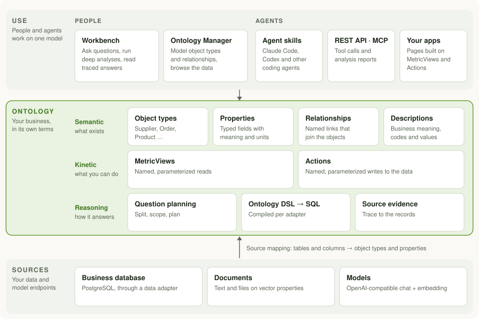

<p align="center">
  
</p>

<h1 align="center">Ontomato</h1>

<p align="center">
  <b>Your business ontology. Answers you can trace.</b>
</p>

<p align="center">
  <a href="LICENSE"></a>
  
</p>

<p align="center">
  <a href="#quick-start">Quick start</a> ·
  <a href="#architecture">Architecture</a> ·
  <a href="docs/development.md">Development</a> ·
  <a href="https://github.com/Aohan/Ontomato/discussions">Discussions</a>
</p>

Ontomato is an open-source ontology layer for business data. You define the things your
business is made of (suppliers, material batches, products, orders), the properties they
carry and the relationships between them, and map them onto the tables you already have.
People and AI agents then work on that one model: they ask questions, run analyses and
build applications, and every answer can be followed back through the ontology to the
source records behind it.

<!-- TODO: demo GIF — ask a question, get the answer, open the source records behind it. -->

## Why an ontology

A model that reads only table and column names has to guess what the data means, and
guesses again for every question. An ontology writes that meaning down once:

- **Business meaning is defined, not inferred.** Object types, properties, units and code
  values carry descriptions in business terms, so `orders.st = 3` becomes an order that
  has shipped.
- **Relationships are named paths.** "Order refers to Product" says how two object types
  connect, so a question can follow supplier → batch → product → order without
  rediscovering the joins.
- **Answers show their work.** Each answer keeps the plan and the source records it was
  calculated from, so it can be checked rather than trusted.
- **One model for everyone.** The web app, coding agents and the applications you build
  all read the same definitions, so they give the same answer to the same question.

## Architecture

<p align="center">
  <picture>
    <source media="(prefers-color-scheme: dark)" srcset="docs/assets/architecture-dark.svg">
    
  </picture>
</p>

- **Sources.** Your business database stays where it is; Ontomato reaches it through a data
  adapter. Text and files can be attached to objects as vector properties. Chat and
  embedding models are any OpenAI-compatible endpoints you choose.
- **Ontology.** The *semantic* layer describes what exists: object types, properties and
  relationships, each mapped to a table or column. The *kinetic* layer defines what you can
  do: MetricViews are named, parameterized reads and Actions are named, parameterized
  writes. The *reasoning* layer turns a question into a plan, compiles Ontology DSL into SQL
  for the adapter, and keeps the evidence.
- **Use.** People work in the Workbench and the Ontology Manager. Agents work through the
  agent skills, the REST API and the MCP server, and the applications you build call
  MetricViews and Actions.

### The ontology file

The whole ontology of a datasource is one JSON document, the **ontomap**. Each object type
names the table it maps to; each property names its column. An abridged example:

```json
{
  "datasetDesc": "Sales of a bicycle maker. Amounts are in CNY.",
  "classList": ["orders", "products"],
  "classDefs": [
    {
      "name": "orders",
      "showName": "Order",
      "desc": "A recorded sale of one product to one customer",
      "attrs": [
        { "name": "id", "showName": "Order ID", "type": "varchar", "primaryKey": true, "desc": "Order number" },
        { "name": "product", "showName": "Product", "type": "varchar", "desc": "ID of the product sold" },
        { "name": "amount", "showName": "Amount", "type": "double", "desc": "Order value in CNY" }
      ]
    },
    {
      "name": "products",
      "showName": "Product",
      "desc": "A bicycle model in the catalogue",
      "attrs": [
        { "name": "id", "showName": "Product ID", "type": "varchar", "primaryKey": true, "desc": "Product code" }
      ]
    }
  ],
  "relationshipDefs": {
    "order_product": {
      "fromClass": "orders", "fromField": "product",
      "toClass": "products", "toField": "id",
      "desc": "Order refers to Product"
    }
  }
}
```

You rarely write it by hand: an agent drafts it from your schema with the
`ontomato-ontomap-builder` skill, and you review it in the Ontology Manager. The skill
documents every field.

## Features

- **Ontology modeling.** Define object types, properties and relationships over existing
  tables in the Ontology Manager, or have an agent draft them for you.
- **Questions answered through the ontology.** Ontomato plans across relationships,
  compiles the plan to SQL and returns the answer with the source records behind it.
- **Deep analysis.** Analysis agents run multi-step analyses and write reports, in the
  Workbench or over MCP.
- **MetricViews and Actions.** Named reads and writes on the ontology that pages, agents and
  other systems call instead of raw SQL.
- **Documents on objects.** Attach text and files to an object's vector properties and
  search them together with structured filters.
- **Built for agents.** Three agent skills, a REST API and an MCP server.
- **Self-hosted.** One Docker Compose stack; your data stays in your database.

## Quick start

### Requirements

| | Minimum |
| --- | --- |
| Server | Docker Engine 26+ with the Compose plugin; 4 CPU cores, 8 GB RAM, 20 GB free disk (8 cores and 16 GB recommended) |
| Chat model | An OpenAI-compatible endpoint at least as capable as `deepseek-v4-flash` |
| Embedding model | An OpenAI-compatible endpoint at least as capable as `qwen3-embedding-8b` |
| Business database | PostgreSQL |

### 1. Deploy

Prebuilt images are not published yet, so build the offline bundle first. The build host
needs Node.js 24+, Git, GNU Make and Docker with the Buildx plugin:

```bash
git clone https://github.com/Aohan/Ontomato.git
cd Ontomato
make build ARCH=amd64                                      # or arm64
docker pull --platform linux/amd64 pgvector/pgvector:pg18  # same architecture
make bundle ARCH=amd64
```

Copy the bundle to the server, unpack it, and in the unpacked directory:

```bash
for f in images/*.tar.gz; do docker load -i "$f"; done
cp .env.example .env    # set POSTGRES_PASSWORD and PUBLIC_HOST
docker compose up -d
```

When `docker compose ps` shows every service healthy, open `http://<host>:3000` and set the
chat and embedding models under **Model Configuration** in the Admin Panel. You can also
preset them in `.env` (`BACKEND_LLM_*`, `BACKEND_EMBEDDING_*`).

`BACKEND_EMBEDDING_DIMENSIONS` (default `2048`) is sent to the embedding model and sizes
the vector tables. Change it in `.env` before the first start if your model needs another
value; it cannot change once data exists.

[deploy/README.md](deploy/README.md) describes the bundle, updates and the remaining
settings.

### 2. Install the agent skills

The skills need Node.js 18+. Install them into your agent (Claude Code, Codex and other
agents supported by [`skills`](https://github.com/vercel-labs/skills)) and point them at
the Workbench:

```bash
npx skills add Aohan/Ontomato --skill ontomato-ontomap-builder ontomato-analyst ontomato-app-builder
export ONTOMATO_URL=http://<host>:3000
```

`ONTOMATO_URL` must be set in the environment your agent runs in. Alternatively, set
`envUrl` in each installed skill's `application.yml`.

| Skill | Use it to |
| --- | --- |
| `ontomato-ontomap-builder` | connect a database, draft and import the ontology, and check it with questions |
| `ontomato-analyst` | read the ontology, run Ontology DSL queries and questions, and reach the analysis agents |
| `ontomato-app-builder` | on a separate test deployment: build and debug MetricViews, Actions and the pages that call them |

For deep analysis reports, also add the MCP server `http://<host>:3000/mcp/analysis-agents`
(Streamable HTTP) to your agent.

<details>
<summary>Install without the <code>skills</code> CLI</summary>

Copy the skill directories from [`agent-skills/`](agent-skills) into your agent's skills
directory, for example:

```bash
mkdir -p .claude/skills && cp -R agent-skills/* .claude/skills/   # Claude Code
mkdir -p .agents/skills && cp -R agent-skills/* .agents/skills/   # Codex
```

</details>

### 3. Build your ontology and ask

Tell your agent which database to model, for example:

> Use the ontomato-ontomap-builder skill. Connect Ontomato to my PostgreSQL database at
> db.example:5432/sales (user `report`, password in `$SALES_DB_PASSWORD`). Model orders,
> customers and products as object types with their relationships, import the ontology,
> and check it with a few questions.

The agent connects the database, reads the tables, drafts the ontology, imports it and
asks test questions. Review and refine the ontology in the Ontology Manager at
`http://<host>:3005`, and ask questions in the Workbench at `http://<host>:3000`.

<details>
<summary>For AI agents setting up Ontomato</summary>

If you are a coding agent asked to set Ontomato up:

1. Follow [Deploy](#1-deploy). Ask the user for the chat and embedding model endpoints and
   keys; do not invent them.
2. Follow [Install the agent skills](#2-install-the-agent-skills) once the stack is healthy,
   then load the skills. If new skills are not picked up in the running session, read each
   installed `SKILL.md` and follow it directly.
3. Use `ontomato-ontomap-builder` to connect the user's database and build the ontology, as
   in [Build your ontology and ask](#3-build-your-ontology-and-ask).

</details>

## Ports

| Port | Service |
| --- | --- |
| 3000 | Workbench and API |
| 3005 | Ontology Manager |
| 18087 | Data engine |
| 5432 | PostgreSQL, on the server's loopback address only |

## Status

Ontomato is an early preview. Current limits:

- PostgreSQL is the only supported business database, and a deployment works with one
  datasource at a time.
- Prebuilt images are not published; deploy from the offline bundle.
- The open-source edition has no login: everyone who can reach the ports has full access.
  Run it on a trusted network.

## Repository layout

| Path | Contents |
| --- | --- |
| `apps/` | application entry points: Workbench, data engine, Ontology Manager |
| `packages/` | shared implementation and contracts |
| `agent-skills/` | the agent skills |
| `deploy/` | the Docker Compose stack |
| `docker/`, `scripts/` | image recipes and build tools |

Local development and image builds are described in [docs/development.md](docs/development.md).

## Community

- Questions and ideas: [GitHub Discussions](https://github.com/Aohan/Ontomato/discussions)
- Bugs: [GitHub Issues](https://github.com/Aohan/Ontomato/issues)
- Contributing: [CONTRIBUTING.md](CONTRIBUTING.md)
- Security: report vulnerabilities privately as described in [SECURITY.md](SECURITY.md)

## License

Ontomato is licensed under the [Apache License 2.0](LICENSE); see also [NOTICE](NOTICE).
Every image carries `LICENSE`, `NOTICE` and a `THIRD_PARTY_NOTICES.txt` listing the
third-party components it contains.
